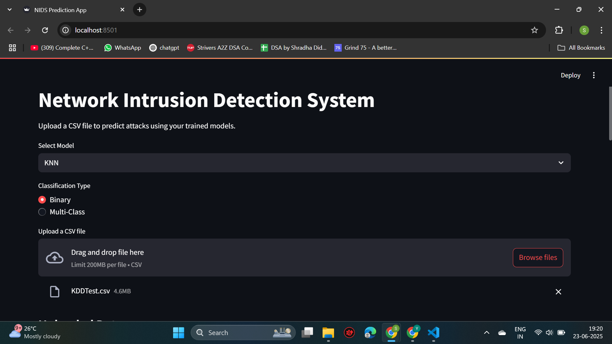

# Network Intrusion Detection System (NIDS)
A deep learning and machine learning-powered Network Intrusion Detection System designed to classify network traffic as either normal or malicious. It supports both binary (normal vs attack) and multi-class (type of attack) classifications using models like CNN, LSTM, KNN, and Random Forest. The project also features a Streamlit-based web interface.

# Objective
Detect and classify malicious network traffic using supervised learning approaches. Help cybersecurity systems identify threats early and efficiently.

# Dataset 
NSL-KDD Dataset (Improved version of KDD'99)

# Results

